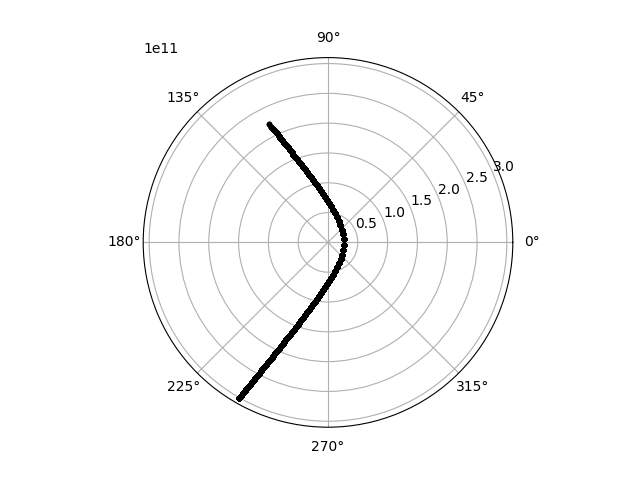
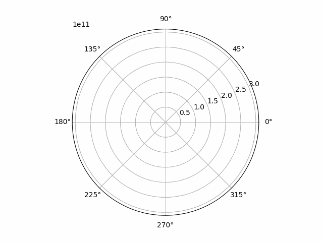

# Hyperbolic and parabolic orbits

Instead of a closed, elliptic orbit like Mercury's objects can also just fly past each other. This happens when we have:

\\[ e \ge 1 \\]

The \\( e > 1 \\) case corresponds to a hyperbole-shaped orbit and the \\( e = 1 \\) case to a parabola and after some algebra the replacement for Kepler equation for these two cases becomes:

\\[ n(t-\tau) = e\sinh{E} - E, \textrm{ when } e \gt 0 \\]

\\[ n(t-\tau) = \frac{E^3}{6}+\frac{E}{2}, \textrm{ when } e = 0 \\]

Where the quantity \\( n \\) cannot geometrically be understood as in the elliptic case, but obeys the formula:

\\[ n = \sqrt{\mu}a^\frac{-3}{2} \\]

In case of an eccentricity greater or equal to 1, `celmec` solves these equations instead of the Kepler equation.

## Simulating a hyperbolic orbit

To simulate a hyperbolic orbit, we can use the Mercury example, but give the nearest planet the following initial conditions:

```
    let rr: Array1<f64> = array![-3e11, 0., 0.];
    let vv: Array1<f64> = array![-6e4, -1e4, 0.];
```

The plotting script also needs a small scaling adjustment then:

```
    ax.set_rlim(rmin=0, rmax=3.1e11)
```

and rerunning the simulation we should end up with the following:



and the same animated:

<details>
  <summary>"Flyby Mercury's" orbit animated</summary>
  
  
  
</details>

You can try playing around with different initial conditions, simulation times and object masses to see what kind of orbits you'll get!

## Parabolic orbit simulation

As it's a bit tedious to construct a combination of initial conditions and masses that would result in an eccentricity of exactly 1, it would be handy if we could start by telling `celmec` to simulate using a given `e`. Here is where it's time to change chapters and talk about orbital elements which will enable us to do just that.
