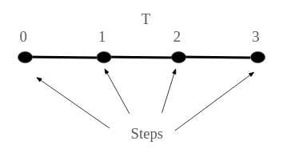
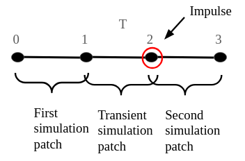
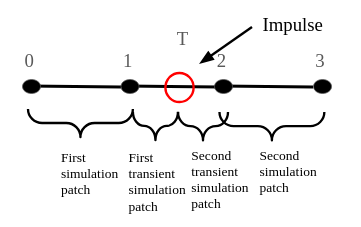
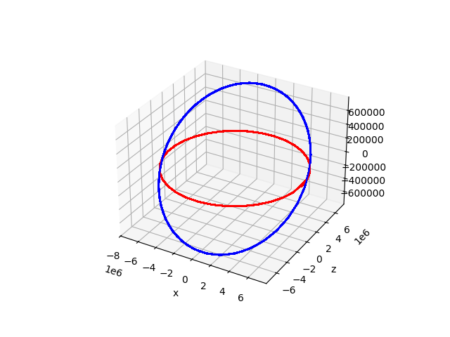
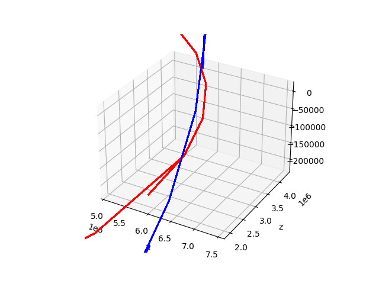
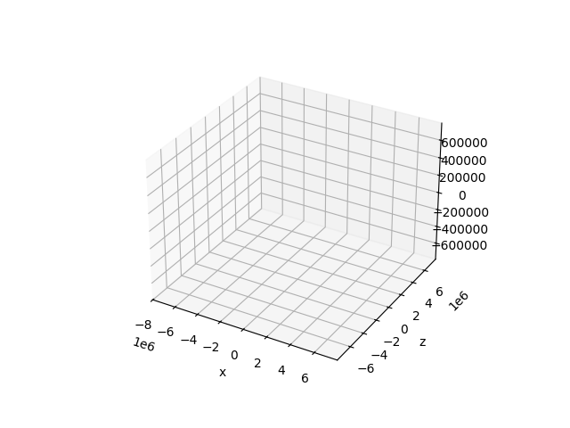

# Impulse: Implementation Details

`Celmec` simulations are done from a starting time to an ending time for a given number of equidistanced steps. We can start from eg. time 0, end at time 3 and have 4 steps. A step represents a time point for which we simulate so the starting and ending times are the first and the last steps, respectively. Therefore, for the 4-step simulation time of the example, the steps are 0, 1, 2 and 3.

<p align="center">
  
</p>

An impulse can happen at any time between start and end time (including the endpoints themselves) and these times may or may not coincide with the steps.

Let's consider what happens when impulse point coincide with step. In this case, a simulation is done up to step before the impulse happens. Then, a transient simulation (in the sense that no results from this simulation are returned) is done from the latest simulated step to the impulse point, after which the impulse is applied. As the impulse point coincides with a step, we can then proceed with the simulation starting from that step but with a velocity modified by the impulse.

Say, that the impulse happens at time 2 in our 4-step example. In that case, a simulation would first run through steps 0 and 1. After that, a transient simulation is done for step 2 using simulation resuslt from step 1 as initial conditions. Then, the impulse is applied to the simulation results at step 2 from the transient simulation. Then the simulation results from step 2 with the impulse applied are used as initial conditions to simulate steps 2 and 3.

<p align="center">
  
</p>

In case the impulse falls between two steps, the process is as follows. First, simulation is done up until the last step before the impulse. Then a transient simulation is done from the lest simulation point to the impulse point. The impulse is applied on the result of the transient simulation at the impulse point. Another transient simulation is carried out starting from the impulse point with the results of the previous transient simulation and the impulse application as the initial conditions. With these initial conditions, the next step is transiently simulated and the results are then used as initial conditions for a simulation from that step onward (including the step itself).

To use the previous 4-step example again, say the impulse happens at time 1.5. In this case a simulation is first done for steps 0 and 1. Then the first transient simulation is done from 1 to 1.5 and the impulse is then applied at the latter point. Using the result of the transient simulation and the application of the impulse as the initial conditions at 1.5, another transient simulation is carried for step 2. The results of this simulation are then set as initial conditions using which steps2 and 3 are simulated.

<p align="center">
  
</p>


## Giving a "Continuous" Impulse

With the information above, we can adjust the example at the end of the previous chapter to match the impulse to a simulation point. In the example, we were simulating for a total of three times the period of the original orbit with 99 points. To match the impulse at the time corresponding one orbit period, let's change the number of simulated points to 100.

Here is why this works: say we simulated for only one period instead of three and had 34 simulation points. Then we would start at the position at the starting time, have 32 steps on the orbit and then our last 34th (starting step + the 32 intermediary steps + 1) step on the starting position again (because after one period, the position is same as at the starting time). So we have 33 distinct positions on the orbit and on hte 34th step we hit the initial position again. Now switch to a total simulation time of 3 periods with 100: for each period we would have 33 distinct positions and then on the 34th step since the start of the period we would hit the initial positions again (ie. on 34th and 67th step counting from the very beginning). Spaving our steps in such a manner, we are guarantted to match step 34 to the period. However, at step 99 we would be a have our 33 distinct positions hit 3 times, but we would need to add an extra step that returns to the initial position at time 3 times the period. And hence we have a grand total of 100 steps.

By modifying the version of the Rust code of the previous section with an impulse in the z-direction by adding a simulation point:

```
    let system = two_body::create_two_body_system(0., period, 100, mu, rr0.clone(), vv0.clone());
```

We get the following graph



For some reason the impulse point does not still not look as smooth as expected, but I'd argue it's already smoother than previously:



Again, a nice animated version to end with:

<details>
	<summary>Continuous z-directional impulse animated</summary>



</details>
