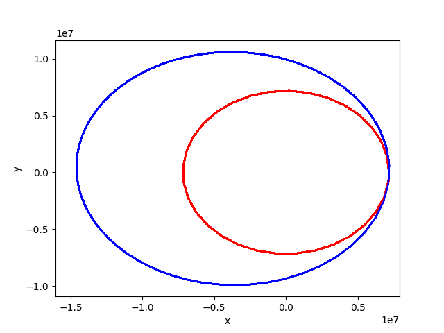
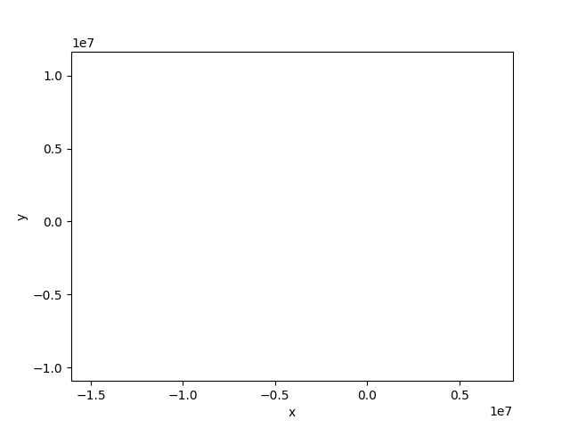
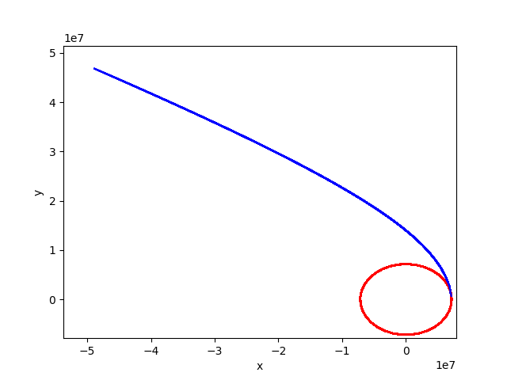
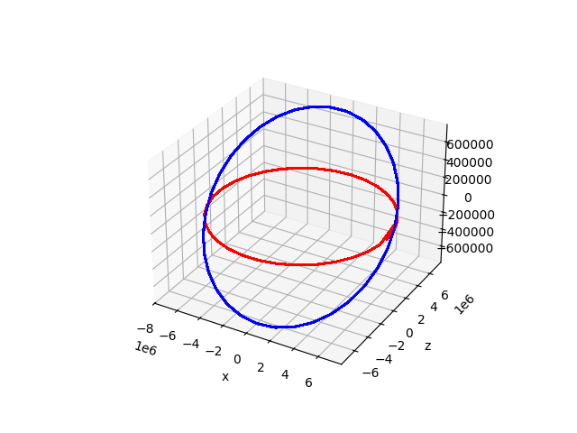
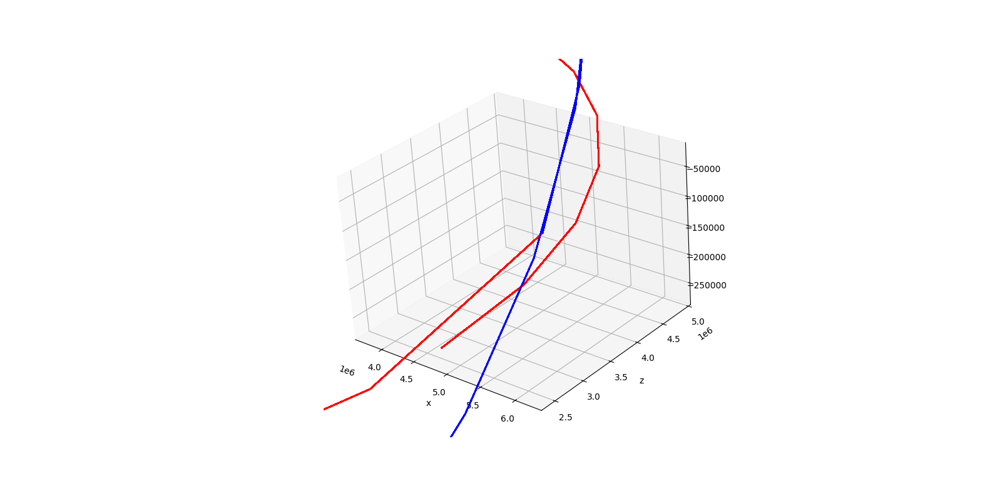
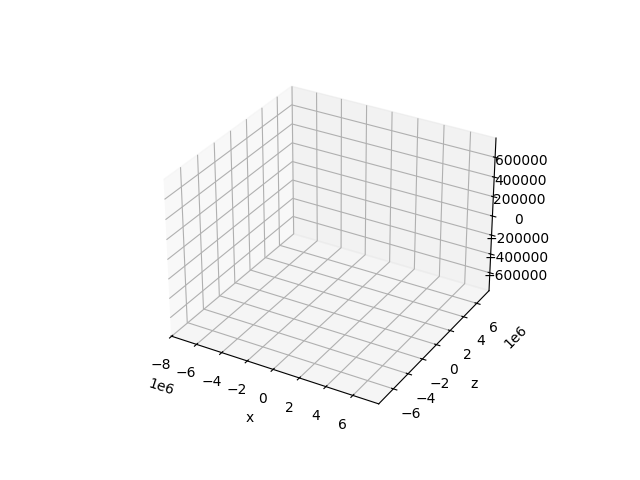

# Impulse

What if we gave a body orbiting another a little push? Such a pushes are called impulses and they are handy to for eg. satellites to move them from one orbit to another.

In `celmec`, an impulse can be applied to a `System`. To make such a simulation, let's again create a new project `cargo init impulse`, navigate to `impulse/src/main.rs` adn add the required imports, which in this case are:

```
use celmec::{impulse, two_body};
use ndarray::{array, Array1, Array2};
use std::f64::consts::PI;
use std::fs::File;
use std::io::Write;
```

So, in addition to the 2-body simulation module `two_body`, we now also import a module called `impulse`.

The let's start crafting a `main` function. We'll simulate a 500 kg satellite orbiting Earth, so let's first calculate the `mu` if that system:

```
    let mu: f64 = two_body::calculate_mu(5.972e24, 5.0e3);
```

Then, let's have the satellite on a circular orbit at an altitude of 800 km. On a circular orbit, the semi-major axis `a` is equal to the radius of the orbit, which in turn is is the sum of the altitude and Earth's radius. We'll store the `a` on a variable for convenience further down the line:

```
    let a: f64 = 8.0e5 + 6.378e6;
```

Next, also for later convenience, let's store the _period_ of the circular orbit ie. how long it takes for the satellite to complete one rotation around the Earth. To that end, we can use the `calculate_period` method from the `two_body` module:

```
    let period: f64 = two_body::calculate_period(mu, a);
```

Then it's time to crate a `System` from an initial position and velocity:

```
    let rr0: Array1<f64> = array![a, 0., 0.];
    let vv0: Array1<f64> = array![0., 2. * a * PI / period, 0.];
    let system =
        two_body::create_two_body_system(0., 3. * period, 99, mu, rr0.clone(), vv0.clone());
```

The magnitude of the y-component of `vv0` is determined as follows: on a circular orbit, the speed of the satellite is constant (and I simply chose to have it in the positive y-direction at time 0) and that constant speed is the length of the orbit devided by the period. The length of the orbit is the circumference of the a spehere of radius `a`, so hence the `2. * a * PI` in the denominator.

Next, we'll define the impulse to be applied. Currently, an impulse in `celmec` is an array of changes in velocity at a given time points. That information is put in an `Array2<f64>` where the first row are the time points and the subsequent rows are the velocity changes's x, y, and z components, respectively. For our simple simulation, let's have a simplu velocity change (or delta-v or Δv) after one period:

```
    let impulse: Array2<f64> = array![[period], [0.], [1.2e3], [0.]];
```

The impulse is in the direction of travel (ie. positive y-direction, check `vv0` which is the same as velocity after a full rotation) and I chose its magnitude (in m/s) by the scientific process of trying out a bunch of values and picking one that seemed to give a nice-looking result (the reader is encouraged to try their own values, more on that at the end of the chapter).

Then it's time to simulate: we'll now use the `impulse` module and its wrap-it-all function `calculate_impulse_effect`:

```
    let orbit: Array2<f64> = impulse::calculate_impulse_effect(&system.clone(), impulse);
```

The outputted `orbit` has the same format as the output of `simulate` on a `System` would have ie. the rows being time, x, y, z, v<sub>x</sub>, v<sub>y</sub> and v<sub>z</sub>, respectively, and columns representing those quantities for each time point of the simulation.

Finally, we'll write the orbit to a `.csv` file for some visualisations:

```
    let mut coordinate_file = File::create("satellite.csv").unwrap();
    write!(coordinate_file, "t,x,y,z,v_x,v_y,v_z\n").unwrap();
    for i in 0..orbit.dim().1 {
        write!(
            coordinate_file,
            "{},{},{},{},{},{},{}\n",
            orbit[[0, i]],
            orbit[[1, i]],
            orbit[[2, i]],
            orbit[[3, i]],
            orbit[[4, i]],
            orbit[[5, i]],
            orbit[[6, i]]
        )
        .unwrap();
    }
```

<details>
  <summary>The complete `main.rs`</summary>
  
```
use celmec::{impulse, two_body};
use ndarray::{array, Array1, Array2};
use std::f64::consts::PI;
use std::fs::File;
use std::io::Write;

fn main() {
    let mu: f64 = two_body::calculate_mu(5.972e24, 5.0e2);
    let a: f64 = 8.0e5 + 6.378e6;
    let period: f64 = two_body::calculate_period(mu, a);
    let rr0: Array1<f64> = array![a, 0., 0.];
    let vv0: Array1<f64> = array![0., 2. * a * PI / period, 0.];
    let system =
        two_body::create_two_body_system(0., 3. * period, 99, mu, rr0.clone(), vv0.clone());
    let impulse: Array2<f64> = array![[period], [0.], [1.2e3], [0.]];

    let orbit: Array2<f64> = impulse::calculate_impulse_effect(&system.clone(), impulse);

    let mut coordinate_file = File::create("satellite.csv").unwrap();
    write!(coordinate_file, "t,x,y,z,v_x,v_y,v_z\n").unwrap();
    for i in 0..orbit.dim().1 {
        write!(
            coordinate_file,
            "{},{},{},{},{},{},{}\n",
            orbit[[0, i]],
            orbit[[1, i]],
            orbit[[2, i]],
            orbit[[3, i]],
            orbit[[4, i]],
            orbit[[5, i]],
            orbit[[6, i]]
        )
        .unwrap();
    }
}
```
  
</details>

## Visualising the results

As before, run `cargo run` to obtain a file called `satellite.csv` with the simulated orbit in it. To visualise the results, a python script called `plot_impulsed_orbit.py` is created:

<details>
  <summary>`plot_impulsed_orbit.py` </summary>
  
```
import pandas as pd
import numpy as np
import math
import matplotlib.pyplot as plt
from matplotlib.animation import FuncAnimation, PillowWriter

df=pd.read_csv("satellite.csv")

def plot_orbit(i):
    if i < 33:
        plt.plot(df.x[0:i], df.y[0:i], 'r')
    else:
        plt.plot(df.x[0:34], df.y[0:34], 'r')
        plt.plot(df.x[33:i], df.y[33:i], 'b')

def main():
    fig = plt.figure()
    plotn=111
    ax = fig.add_subplot(plotn)
    ax.set_xlabel("x")
    ax.set_ylabel("y")
    ax.set_xlim([1.1*np.min(df.x), 1.1*np.max(df.x)])
    ax.set_ylim([1.1*np.min(df.y), 1.1*np.max(df.y)])
    anim = FuncAnimation(fig, plot_orbit, frames=101, repeat=False)

    f = r"satellite.gif"
    writergif = PillowWriter(fps=20)
    anim.save(f, writer=writergif)

    plt.show()

if __name__ == "__main__":
    main()
```
  
</details>

and run with `python plot_impulsed_orbit.py`. It should produce a graph like this one:



For clarity, the orbit before the impulse is colored red and the orbit after applying the impulse is colored blue. The impulse has transformed the previously circular orbit into an ellipsis whose periapsis has remained at the point where the impulse was applied. Because the orbit was initially on the xy-plane and and impulse along that plane kept it there, visualisation is only done on that plane. However, the Rust code writes the coordinates in all dimensions down, so if you feel like editing the impulse of the Rust code into something different, you'll have the necessary output from the code to do 3d-visualisations by editing the Python script.

There is also an animation `satellite.gif` which should look more or less like this:

<details>
  <summary>Satellite impulse animated</summary>
  
  
  
</details>

## Two alternative impulses

For the sake of a bit of fun let's try two edits to the `impulse` in the Rust code.

Firstly, let's keep the impulse's direction but triple its magnitude:

```
    let impulse: Array2<f64> = array![[period], [0.], [3. * 1.2e3], [0.]];

```

Then `cargo run` and `python plot_impulsed_orbit.py` should produce this visualisation:



So this new impulse was big enough to throw the sateliite out of Earth's orbit into a hyperbolic trajectory.

Secondly, let's dip the the orbit into the z-direction:

```
    let impulse: Array2<f64> = array![[period], [0.], [0.], [0.1 * 2. * a * PI / period]];
```

Now we can generate a 3d graph with a modified Python script:

<details>
	<summary>The modified Python script for 3d graph</summary>

```
import pandas as pd
import numpy as np
import math
import matplotlib.pyplot as plt
from matplotlib.animation import FuncAnimation, PillowWriter

df=pd.read_csv("satellite.csv")

def plot_orbit(i):
    if i < 33:
        plt.plot(df.x[0:i], df.y[0:i], df.z[0:i], 'r')
    else:
        plt.plot(df.x[0:34], df.y[0:34], df.z[0:34], 'r')
        plt.plot(df.x[33:i], df.y[33:i], df.z[33:i], 'b')

def main():
    fig = plt.figure()
    plotn=111
    ax = fig.add_subplot(plotn, projection='3d')
    ax.set_xlabel("x")
    ax.set_ylabel("y")
    ax.set_ylabel("z")
    ax.set_xlim([1.1*np.min(df.x), 1.1*np.max(df.x)])
    ax.set_ylim([1.1*np.min(df.y), 1.1*np.max(df.y)])
    ax.set_zlim([1.1*np.min(df.z), 1.1*np.max(df.z)])
    anim = FuncAnimation(fig, plot_orbit, frames=101, repeat=False)

    f = r"satellite.gif"
    writergif = PillowWriter(fps=20)
    anim.save(f, writer=writergif)

    plt.show()

if __name__ == "__main__":
    main()
```

</details>

Now a `cargo run` and `python plot_impulsed_orbit.py` should generate an image like:



Looking at the point of the impulse in more detail, we see that the first orbit does not quite close, even though the impulse happens when the first period completes. This is because, the impulse point does not match any simulation point and thus there is a "discontinuous" jump between the last simulation point of the un-impulsed orbit and the first simulation point of the impulsed points. 


The next subchapter deals with the implementation details of the impulse and explains how to match the simulation and impulse points. But before that, here is the animated version of the 3d orbit toconclude this section:

<details>
	<summary>Impulse in the z-direction animated</summary>



</details>
