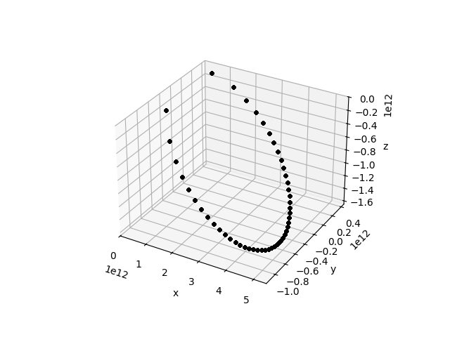
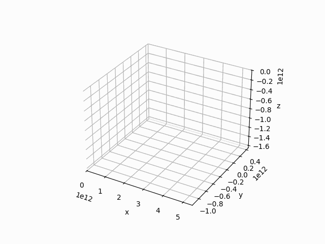

# Keplerian Elements: Coordinate Transformation

So far all the visualisations in this book have been restricted to the orbital plane of the system being simulated. However, the Keplerian elements contain a bunch of angles, which determine the the position of the orbit with respect to the orbital plane of the Earth. For 3d visuals, let us know use these angles to switch from the plane of the system to a three-dimensional volume where the Sun lies at origin and the xy-plane is the orbital plane of the earth and use cartesian coordinates there. In order to do that, we can copy the code from the original simulation of Halley's comet's orbit and add some pieces.

Firstly, in order to do the coordinate switch, we'll need the `transformations` module of `celmec` so we'll modify our imports as follows:

```
use celmec::{orbit, orbital_elements, transformations};
```

Then, after calculating the radii and true anomalies, the new module can be used to perform the coordinate transformation:

```
    let cartesian_coordinates: (Array1<f64>, Array1<f64>, Array1<f64>) =
        transformations::cartesian_coordinates_from_f_r_and_keplerian_elements(
            f.clone(),
            radius.clone(),
            halleys_keplerian_elements,
        );

```

Then the output file generation has to be adjusted as well. Instead of what we previously had, we'll use:

```
    let mut coordinate_file = File::create("halleys_orbit_3d.csv").unwrap();
    write!(coordinate_file, "x,y,z\n").unwrap();
    for i in 0..=(ticks - 1) {
        write!(
            coordinate_file,
            "{},{},{}\n",
            cartesian_coordinates.0[i], cartesian_coordinates.1[i], cartesian_coordinates.2[i],
        )
        .unwrap();
    }
```

### The Final Rust Code

In the end, `Config.toml` should look like this:

```
[package]
name = "coordinate-transformation"
version = "0.1.0"
edition = "2021"

[dependencies]
ndarray = "0.15.6"
celmec = { git = "https://github.com/juuso22/celmec.git" }
```

and `main.rs` should look like this

```
use celmec::{orbit, orbital_elements, transformations};
use ndarray::Array1;
use std::fs::File;
use std::io::Write;

fn main() {
    let halleys_keplerian_elements = orbital_elements::KeplerianElements {
        e: 0.96658,
        longitude_of_the_ascending_node: 1.03666,
        tau: 0.,
        a: 2.65342e12,
        iota: 2.82674,
        omega: 1.95564,
    };

    let ticks = 50;
    let rotation_time: f64 = 2379801600.;
    let mu: f64 = orbit::calculate_mu(1.989e30, 0.);
    let f: Array1<f64> = orbit::calculate_f_from_keplerian_elements(
        &halleys_keplerian_elements,
        mu,
        halleys_keplerian_elements.tau - rotation_time / 2.,
        halleys_keplerian_elements.tau + rotation_time / 2.,
        ticks,
    );

    let radius = orbit::calculate_r_from_f(
        f.clone(),
        halleys_keplerian_elements.e,
        halleys_keplerian_elements.a,
    );

    let cartesian_coordinates: (Array1<f64>, Array1<f64>, Array1<f64>) =
        transformations::cartesian_coordinates_from_f_r_and_keplerian_elements(
            f.clone(),
            radius.clone(),
            halleys_keplerian_elements,
        );

    let mut coordinate_file = File::create("halleys_orbit_3d.csv").unwrap();
    write!(coordinate_file, "x,y,z\n").unwrap();
    for i in 0..=(ticks - 1) {
        write!(
            coordinate_file,
            "{},{},{}\n",
            cartesian_coordinates.0[i], cartesian_coordinates.1[i], cartesian_coordinates.2[i],
        )
        .unwrap();
    }
}
```

### Visualising the results

For the visualisation, the following python script can be used:

```
import pandas as pd
import numpy as np
import math
import matplotlib.pyplot as plt
from matplotlib.animation import FuncAnimation, PillowWriter

df=pd.read_csv("halleys_orbit_3d.csv")

def plot_3d_orbit(i):
    plt.plot(df.x[0:i], df.y[0:i], df.z[0:i], 'k.')

def main():
    fig = plt.figure()
    plotn=111
    ax = fig.add_subplot(plotn, projection='3d')
    ax.set_xlabel("x")
    ax.set_ylabel("y")
    ax.set_zlabel("z")
    ax.set_xlim([0, 1.1*np.max(df.x)])
    ax.set_ylim([1.1*np.min(df.y), 1.1*np.max(df.y)])
    ax.set_zlim([1.1*np.min(df.z), 0])
    anim = FuncAnimation(fig, plot_3d_orbit, frames=50, repeat=True)
    
    f = r"halley_3d.gif"
    writergif = PillowWriter(fps=20)
    anim.save(f, writer=writergif)

    plt.show()

if __name__ == "__main__":
    main()

```

which can be run like this:

```
python plot_halleys_3d_orbit.py
```

This should give an image like this:



and the same animated:

<details>
  <summary>Halley's 3d orbit animated</summary>
  
  
  
</details>
