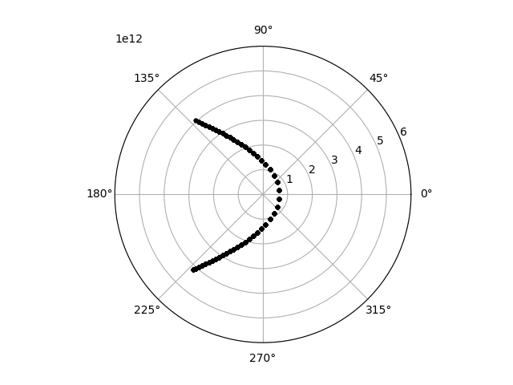
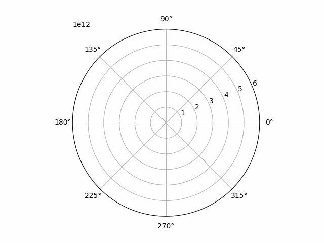

# Keplerian Elements: Parabolic Orbit

With Keplerian elements, creating a simulation for parabolic orbit becomes somewhat easier. Instead of trying to figure out a right position-velocity combination to get \\( e = 1 \\), we can just set the eccentricity to one. Let's do that for Halley's comet by changing the definition of the Keplerian elements from the previous simulation to the following:

```
    let halleys_keplerian_elements = orbital_elements::KeplerianElements {
        e: 1., //This has now changed compared to the previous simulation
        longitude_of_the_ascending_node: 1.03666,
        tau: 0.,
        a: 2.65342e12,
        iota: 2.82674,
        omega: 1.95564,
    };

```

One further change is needed. As the orbit will now be parabolic, there is no longer a `rotation_time` which can be used to calculate the 5th argument in:

```
    let eccentric_anomaly: Array1<f64> = orbit::calculate_eccentric_anomaly_iteratively(
        time.clone(),
        time.clone(),
        0.00001,
        100,
        2. * PI / rotation_time,
        halleys_keplerian_elements.e,
        halleys_keplerian_elements.tau,
    );
```

But that 5th argument is the quantity \\(n\\), which can alternatively be calculated from the formula:

\\[ n = \sqrt{\mu}a^\frac{-3}{2}, \textrm{ where } \mu = G(m_1m_2) \\]

`celmec` in fact has functions to calculate bot \\(n\\) and \\(\mu\\). Let's first add a line somewhere before the calculation of the eccentric anomaly which calculates the latter. I'll be lazy and not look up any estimates for the mass of the comet but simply set \\(m_1\\) to the mass of the Sun and \\(m_2=0\\):

```
    let mu: f64 = orbit::calculate_mu(1.989e30, 0.);

```

Then the 5th parameter in the calculation of the eccentric anomaly can be set as follows:

```
    let eccentric_anomaly: Array1<f64> = orbit::calculate_eccentric_anomaly_iteratively(
        time.clone(),
        time.clone(),
        0.00001,
        100,
        orbit::calculate_n(mu, halleys_keplerian_elements.a),
        halleys_keplerian_elements.e,
        halleys_keplerian_elements.tau,
    );
```

When you run the simulation, Rust compiler will complain about unused import of the `PI` constant. You can get rid of that by commenting the line:

```
use std::f64::consts::PI;
```

if you want to.

## Simulation results

Running the modified Rust coed and the plotter script should yield the following nice parabola:



And the same thing animated:

<details>
  <summary>"Flyby Halley's" orbit animated</summary>
  
  
  
</details>
