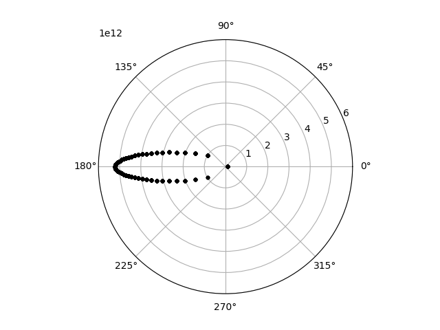
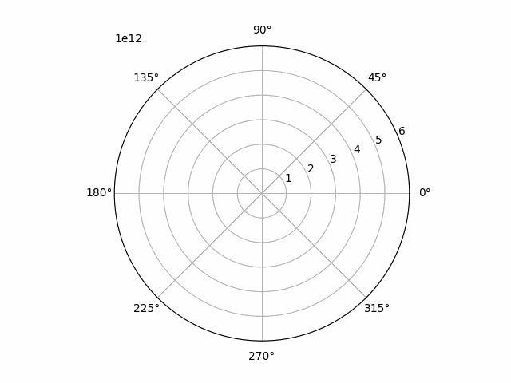

# Keplerian Elements: Simulation

To demonstrate the use of Keplerian elements, let's calculate the orbit of [Halley's comet](https://en.wikipedia.org/wiki/Halley%27s_Comet). I have stolen the Keplerian elements from Wikipedia.

## Walking through the writing of the simulation

First init a new rust project called `halleys-comet`:

```
cargo init halleys-comet
```

Edit the project's `Cargo.toml` by adding the following under `[dependencies]`:

```
celmec = { git = "https://github.com/juuso22/celmec.git" }
ndarray = "0.15.6" #Or choose your preferred version
```

Then we can start editing the project's `src/main.rs`. First, remove the default content and import the following from `ndarray` 

```
use ndarray::{Array, Array1}
```

Then import the following from celmec:

```
use celmec::orbital_elements
```

The `orbital_elements` module contains a sturct called `KeplerianElements` which will contain the Keplerian elements of the body we want to simulate. The following abbreviations for the elements are used (for a full list of all abbreviations used in celmec see [Glossary of Terms](./glossary_of_terms.md)):

```
a - semi-major axis
e - eccentricity
iota - inclination
tau - perihelion time
omega - argument of periapsis
```

In our main function, let's create an instance of `KeplerianElements` for Halleys' comet:

```
    let halleys_keplerian_elements = orbital_elements::KeplerianElements {
        e: 0.96658,
        longitude_of_the_ascending_node: 1.03665,
        tau: 0.,
        a: 2.65342e12,
        iota: 2.82673,
        omega: 1.95564,
    };
```

Everything is in SI units and the perihelion time is set to zero for simplicity.

Next, we need some mote imports from celmec to actually calculate something using the orbital elements:

```
use celmec::{orbit, orbital_elements};
```

The `orbit` module has functions to calculate properties of the orbit and/or time evolution of various quantities. We'll first calculate the time evolution of true anomaly (denoted `f`) from the Keplerian elemnts. We'll cheat a little and choose the time interval for which calculate from `tau` to `tau` + the time of one rotation of the comet around the sun to see a nice full ellipsis. The time of the rotation we look up again from Wikipedia and convert it to seconds:

```
    let ticks = 200;
    let rotation_time = 2379801600.;
    let time: Array1<f64> = Array::linspace(halleys_keplerian_elements.tau, halleys_keplerian_elements.tau + rotation_time, ticks);
    let f: Array1<f64> = orbit::calculate_f_from_series(
        time.clone(),
        halleys_keplerian_elements.e,
        rotation_time,
        halleys_keplerian_elements.tau,
    );
```

Here series refers to the Fourier series. The array `f` represents the true anomaly at each point of time we are calculating for.

From true anomaly and the Keplerian elemnts, polar coordinates (with Sun at the origin) be calculated over our chosen time interval `time`. First we need to add another import, though:

```
use celmec::{orbit, orbital_elements, transformations};
```

Then we can calculate:

```
    let radius = orbit::calculate_radius_from_f(
        f.clone(),
        halleys_keplerian_elements.e,
        halleys_keplerian_elements.a,
    );
    let polar_angle = transformations::polar_angle_from_keplerian_elements(
        f.clone(),
        halleys_keplerian_elements.iota,
        halleys_keplerian_elements.omega,
    );
```

Let's write the polar coordinates and time into a file. First some imports:

```
use std::fs::File;
use std::io::Write;
```

Then the actual writing:

```
    let mut coordinate_file = File::create("halleys_polar_coordinates.csv").unwrap();
    write!(coordinate_file, "t,radius,polar_angle\n").unwrap();
    for i in 0..=(ticks - 1) {
        write!(
            coordinate_file,
            "{},{},{}\n",
            time[i], radius[i], polar_angle[i]
        )
        .unwrap();
    }
```

## Final rust code

`Cargo.toml`:

```
[package]
name = "halleys-comet"
version = "0.1.0"
edition = "2021"

# See more keys and their definitions at https://doc.rust-lang.org/cargo/reference/manifest.html

[dependencies]
ndarray = "0.15.6"
celmec = { git = "https://github.com/juuso22/celmec.git" }
```

`src/main.rs`:

```
use celmec::{orbit, orbital_elements, transformations};
use ndarray::{Array, Array1};
use std::fs::File;
use std::io::Write;

fn main() {
    let halleys_keplerian_elements = orbital_elements::KeplerianElements {
        e: 0.96658,
        longitude_of_the_ascending_node: 1.03665,
        tau: 0.,
        a: 2.65342e12,
        iota: 2.82673,
        omega: 1.95564,
    };

    let ticks = 200;
    let rotation_time: f64 = 2379801600.;
    let time: Array1<f64> = Array::linspace(
        halleys_keplerian_elements.tau,
        halleys_keplerian_elements.tau + rotation_time,
        ticks,
    );
    let f: Array1<f64> = orbit::calculate_f_from_series(
        time.clone(),
        halleys_keplerian_elements.e,
        rotation_time,
        halleys_keplerian_elements.tau,
    );

    let radius = orbit::calculate_radius_from_f(
        f.clone(),
        halleys_keplerian_elements.e,
        halleys_keplerian_elements.a,
    );
    let polar_angle = transformations::polar_angle_from_keplerian_elements(
        f.clone(),
        halleys_keplerian_elements.iota,
        halleys_keplerian_elements.omega,
    );

    let mut coordinate_file = File::create("halleys_polar_coordinates.csv").unwrap();
    write!(coordinate_file, "t,radius,polar_angle\n").unwrap();
    for i in 0..=(ticks - 1) {
        write!(
            coordinate_file,
            "{},{},{}\n",
            time[i], radius[i], polar_angle[i]
        )
        .unwrap();
    }
}
```

## Visualising the results

To visualise the results, the following bit of Python code can be used. Have Python and the necessary libraries installed, and then run the script inside the base directory of the cargo project with:

```
python plot_halleys_orbit.py
```

The script itself:

```
import pandas as pd
import math
import matplotlib.pyplot as plt
from matplotlib.animation import FuncAnimation, PillowWriter

df=pd.read_csv("halleys_orbit_2d.csv")

def plot_2d_orbit(i):
    plt.polar(df.f[0:i], df.radius[0:i], 'k.')

def main():
    fig = plt.figure()
    plotn=111
    ax = fig.add_subplot(plotn, polar=True)
    ax.set_rlim(rmin=0, rmax=6e12)    
    anim = FuncAnimation(fig, plot_2d_orbit, frames=50, repeat=True)
    
    f = r"halley.gif" 
    writergif = PillowWriter(fps=20)
    anim.save(f, writer=writergif)

    plt.show()

if __name__ == "__main__":
    main()

```

### So what do the simulation results look like

The way the above python script is done, should save an animated gif, but print a graph where the position of the comet at all the chosen time points. That graph should look something like this:



The orbit look like an ellipse as it should. Moreover, it can be seen that the further from the middle (ie. the Sun) the comet is the closer the plotted orbit points are to each other. As the time between two consecutive points is constant, this means that the further the comet is from the Sun, the slower it moves. This is even clearer in the animation of the orbit:

<details>
  <summary>Halley's comet's orbit animated</summary>
  
  
  
</details>

This is in fact what *Kepler's third law* tells us and to explain what that is all about, it's best to jump to the next physics chapter.
