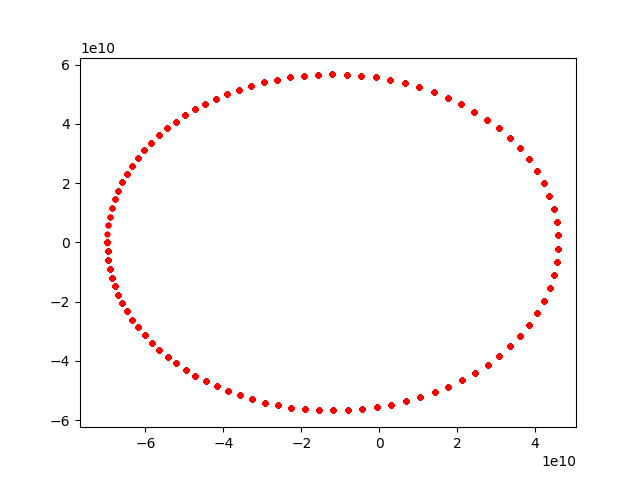

# System: A `celmec` Data Structure

Before moving forward with the physics, I'll introduce the concept of a `System`. In `celmec`, a `System` is a celestial mechanics entity whose time-evolution can be simulated. As an example, the two bodies with one orbiting around the other as we have seen in this books so far is a system. In fact, such a `TwoBodySystem`  is currently the only available `System` in `celmec`. The concept of a `System` will, however, enable creation of further systems such as ones having more than two bodies or using a gravitational potential other than that of a sphere.

## Making a Simulation using a `TwoBodySystem`

To simulate a `TwoBodySystem`, let's first create a new project with: `cargo init system`. Then we'll start crafting `systrem/src/main.rs`.

First we need some imports:

```
use celmec::{system::System, two_body};
use ndarray::{array, Array1, Array2};
use std::fs::File;
use std::io::Write;
```

The first line imports the already familiar methods to manipulate a 2-body system and, with `system::System` the methods that any `System` has available.

Then, inside the `main` function, we shall wipe out the default "Hello, world" stuff and start by adding some information that will make up our `TwoBodySystem` to be:

```
    let mu: f64 = two_body::calculate_mu(3.301e23, 1.989e30);
    let rr: Array1<f64> = array![-69.818e9, 0., 0.];
    let vv: Array1<f64> = array![0., -38.86e3, 0.];

    let end_time: f64 = 7603200.;

```

These are the same things that were allready used in our first 2-body simulation of Mercury.

Next we'll do something different though: create a `TwoBodySystem`:

```
    let system: two_body::TwoBodySystem = two_body::create_two_body_system(0., end_time, 100, mu, rr, vv);
```

The inputs of the `create_two_body_system` are: starting time of the simulation, ending time of the simulation, number of simulated steps, the gravitational parameter, the initial position of the orbiting body with respect to the central body and the initial velocity of the orbiting body with respect to the central body. You can always also check the function out in the technical docs.

Any simulation of a `System` will output an array of arrays (`Array2<f64>`) where the rows are simulation results for all the simulation steps and a the columns represent time, x,y and coordinates and v<sub>x</sub>, v<sub>y</sub> and v<sub>z</sub> going from column number 0 upwards. For a `TwoBodySystem` the cartesian coordinated are with respect to a system where the xy-plane is defined as the plane against which inclination is measured and positive x-axis points into the direction from which longitude of the ascending node is measured. To get simulation result orbit, we do:

```
 let orbit: Array2<f64> = system.simulate();
```

And then write the simulation results in a file to be used for visualisations:

```
    let mut coordinate_file = File::create("mercury.csv").unwrap();
    write!(coordinate_file, "t,x,y,z,v_x,v_y,v_z\n").unwrap();
    for i in 0..orbit.dim().1 {
        write!(
            coordinate_file,
            "{},{},{},{},{},{},{}\n",
            orbit[[0, i]],
            orbit[[1, i]],
            orbit[[2, i]],
            orbit[[3, i]],
            orbit[[4, i]],
            orbit[[5, i]],
            orbit[[6, i]]
        )
        .unwrap();
    }
```


<details>
	<summary>The complete `main.rs`</summary>

```
use celmec::{system::System, two_body};
use ndarray::{array, Array1, Array2};
use std::fs::File;
use std::io::Write;

fn main() {
    let mu: f64 = two_body::calculate_mu(3.301e23, 1.989e30);
    let rr: Array1<f64> = array![-69.818e9, 0., 0.];
    let vv: Array1<f64> = array![0., -38.86e3, 0.];

    let end_time: f64 = 7603200.;

    let system: two_body::TwoBodySystem = two_body::create_two_body_system(0., end_time, 100, mu, rr, vv);

    let orbit: Array2<f64> = system.simulate();

    let mut coordinate_file = File::create("mercury.csv").unwrap();
    write!(coordinate_file, "t,x,y,z,v_x,v_y,v_z\n").unwrap();
    for i in 0..orbit.dim().1 {
        write!(
            coordinate_file,
            "{},{},{},{},{},{},{}\n",
            orbit[[0, i]],
            orbit[[1, i]],
            orbit[[2, i]],
            orbit[[3, i]],
            orbit[[4, i]],
            orbit[[5, i]],
            orbit[[6, i]]
        )
        .unwrap();
    }
}
```

</details>

### Visualising the results

In order to run the created Rust code, jump into its `system` project directory and run `cargo run`. To get some visuals out of the generated `mercury.csv` file, run the following python script with `python plot_system_orbit.py`: 

<details>
	<summary>Python script for orbit visualisation</summary>
	
```
import pandas as pd
import numpy as np
import math
import matplotlib.pyplot as plt
from matplotlib.animation import FuncAnimation, PillowWriter

df=pd.read_csv("mercury.csv")

def main():    
    fig = plt.figure()
    plotn=111
    ax = fig.add_subplot(plotn)
    ax.set_xlim([1.1*np.min(df.x), 1.1*np.max(df.x)])
    ax.set_ylim([1.1*np.min(df.y), 1.1*np.max(df.y)])

    plt.plot(df.x, df.y, 'r.')
    plt.show()

if __name__ == "__main__":
    main()
```

</details>

This should produce a familiar-looking ellipse from the first chapter:



Note that the initial conditions were chosen so that the orbit lies on the xy-plane. Hence the z-coordinate is 0 throughout.

## `System` in Rust terms

In Rust terms, `System` is actually a trait. That means roughly that it defines a collection of methods that any struct _implementing_ that trait (such as `TwoBodySystem`) must define (or use the default definitions of the methods in the trait if they exist). [More on traits in the Rust book](https://doc.rust-lang.org/book/ch10-02-traits.html). That means, that you can in fact implement your own `System` if you feel so inclined!
