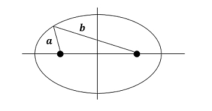
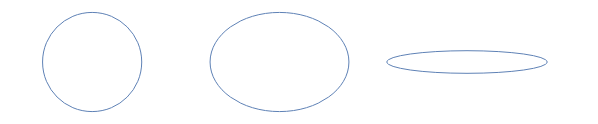

# Two Body Problem: Necessary concepts

Before using `celmec` for simulations, a bare minimum of celestial mechanics concepts are needed. Those familiar with the topic can jump to [the next sub-chapter](two-body-problem-simulation.html) which deals with writing a first simulation.

`celmec` solves the two-body problem using Newtonian gravitation: a mathematical model to describe the motion of planets around the sun (and all other bodies gravitationally acting with each other for that matter). The following uses results and properties from that model which match the observed reality fairly well for the contents of this chapter. It is good to bear in mind that the Newtonian model for gravity does not hold in all situations and that for the examples to come, simplifications about reality have been done.

Due to the force of gravity the planets around the sun on trajectories that are ellipses, with the sun in on of the foci of the ellipse. The foci are 2 such points inside the ellipse that the sum of the radii from each of them to a point on the ellipse is a constant. In the picture the balck dots are the foci, a and b the radii and a+b is constant:

  
  <figcaption>Foci of an ellipse: the black dots are the foci, a+b is constant</figcaption>

If the focii are close to one another, the ellipse becomes a circle. As they become further apart, the ellipse becomes more "elongated". A measure of this elongation is called eccentricity which ranges from 0 for a circle and gets closer and closer to 1 as the focii become infinetly far apart. The picture below shows some ellipses for different values of eccentricity, 0, 0.7 and 0.99, respectively:

  
  <figcaption>Ellipses of eccentricities 0 (circle), 0.7 and 0.99</figcaption>

The shape, size and motion of a planet along the elliptic orbit can be determined from 3 things:

1. The gravitational parameter \\( \mu \\) which is the sum of the masses of the sun and the planet multiplied by an observational constant called the gravitational constant \\( G \\). The equation for \\( \mu \\) is then: \\( \mu = G(m_{planet} + m_{sun}) \\)
2. One observed position of the planet with respect to the sun
3. The observed speed of the planet with respect to the sun when it is at he position from the previous point

With this knowledge in mind, we can throw ourselves into our first simulation.
