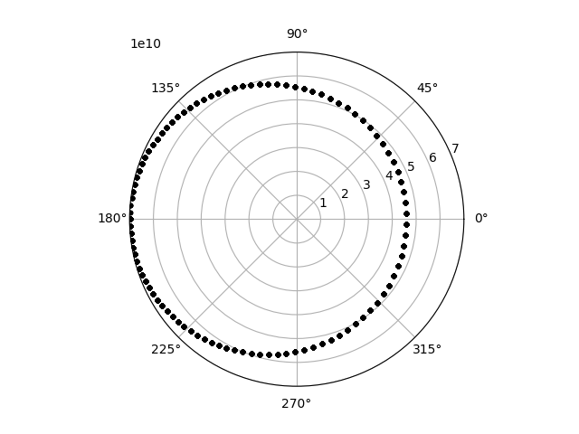
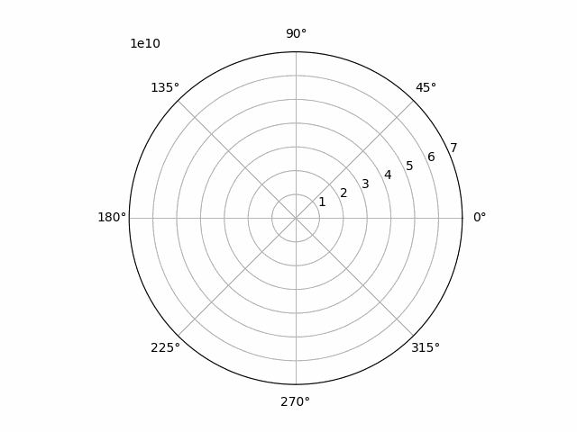

# Two Body Problem: Simulation

As a first simulation with `celmec`, we'll simulate one round of Mercury around the sun as a two body problem. We'll first walk through building the simulation, but the final Rust code can be found further down.

## Walking through the writing of the simulation

First init a new Rust project called `two-body-problem`:

```
cargo init two-body-problem
```

Edit the project's `Cargo.toml` by adding the following under `[dependencies]`:

```
ndarray = "0.15.6" #Or choose your preferred version
celmec = { git = "https://github.com/juuso22/celmec.git" }
```

Then we can start editing the project's `src/main.rs`. First, remove the default content and import the following from `ndarray` 

```
use ndarray::{Array, Array1}
```

Then import the following from celmec:

```
use celmec::orbit;
```

The `orbit` module contains functions functions for the simulation.

Next, we need the masses of Mercury and the sun and some initial conditions for the position and velocity of the planet with respect to the sun. Sun's mass is (the googlable) 1.989 * 10<sup>30</sup>kg and the mass of Mercury (along other info about the planet that will be used), namely 3.3010 * 10<sup>23</sup> kg, can be found from [Nasa's fact sheet](https://nssdc.gsfc.nasa.gov/planetary/factsheet/mercuryfact.html). To have some simple initial conditions, let's have Mercury furthest away from the sun it reaches (ie. Mercury's aphelion) and let's fix our coordinates so that this point is to the direction of the negative x-axis. The distance of Mercury from the sun in the aphelion is 69.818 * 10<sup>9</sup> m. According to Kepler's third law, Mercury's orbital velocity is the slowest at aphelion. That slowest speed is 38.86 * 10<sup>3</sup> m/s and that is in the direction of the negative y-axis. Let's decide, for convenience, that is the to the direction of the negativee y-axis. As a small spoiler, choosing to start with negative values will align our xy-plane nicely with the choice of polar coordinates that will be done later. Now we write all this into the `main` function of our project:

```
    let mu: f64 = orbit::calculate_mu(3.301e23, 1.989e30);
    let rr: Array1<f64> = array![-69.818e9, 0., 0.];
    let vv: Array1<f64> = array![0., -38.86e3, 0.];
```

Before using these values for the simulation, let's first check a key quantity of the system from them: the eccentricity `e`:

```
    let e: f64 = orbit::calculate_e(rr.clone(), vv.clone(), mu);
    println!("Eccentricity: {}", e);
```

Then we need some info about how long and how finely we want to simulate:

```
    let steps: usize = 100;
    let simulation_time: f64 = 7603200.;
```

The `steps` is the number of point we want to have results for and `simulation_time` is the sideral orbit period from the fact sheet above converted to seconds (so * 24 h/d * 60 min/h * 60 s/min). Then we can calculate the true anomaly `f` for our simulation period using `celmec`:

```
    let f: Array1<f64> = orbit::calculate_f_from_initial_rr_and_vv(
        rr.clone(),
        vv.clone(),
        mu,
        simulation_time,
        steps,
    );

```

Despite starting with xy-coordinates, let's switch to polar coordinates as they are somewhat more convenient for orbits. We chose the orbital plane as our xy-plane and in that plane `f` will serve as the angle for polar coordinates in that plane. But we still need radii corresponding to the values of `f` we obtained above. For that, we need the semi-major axis `a` of the system and can then proceed to calculate the radius:

```
    let a: f64 = orbit::calculate_a_from_initial_rr_and_vv(rr, vv, mu);
    let radius: Array1<f64> = orbit::calculate_radius_from_f(f.clone(), e, a);
```

Let's then print some values from our simulation as checks:

```
    println!(
        "Maximum distance from the sun (aphelion): {}",
        radius.iter().max_by(|a, b| a.total_cmp(b)).unwrap()
    );
    println!(
        "Minimum distance from the sun (perihelion): {}",
        radius.iter().min_by(|a, b| a.total_cmp(b)).unwrap()
    );
```

And then write the results into a file. First some imports to the beginning of our `main.rs`:

```
use std::fs::File;
use std::io::Write;
```

And then the actual writing inside the main function:

```
    let mut coordinate_file = File::create("mercury.csv").unwrap();
    write!(coordinate_file, "radius,f\n").unwrap();
    for i in 0..=(steps - 1) {
        write!(coordinate_file, "{},{}\n", radius[i], f[i]).unwrap();
    }
```

## Final Rust code

`Cargo.toml`:

```
[package]
name = "two-body-problem"
version = "0.1.0"
edition = "2021"

[dependencies]
ndarray = "0.15.6"
celmec = { git = "https://github.com/juuso22/celmec.git" }
```

`main.rs`:

```
use celmec::orbit;
use ndarray::{array, Array1};
use std::fs::File;
use std::io::Write;

fn main() {
    let mu: f64 = orbit::calculate_mu(3.301e23, 1.989e30);
    let rr: Array1<f64> = array![-69.818e9, 0., 0.];
    let vv: Array1<f64> = array![0., -38.86e3, 0.];

    let e: f64 = orbit::calculate_e(rr.clone(), vv.clone(), mu);
    println!("Eccentricity: {}", e);

    let steps: usize = 100;
    let simulation_time: f64 = 7603200.;

    let f: Array1<f64> = orbit::calculate_f_from_initial_rr_and_vv(
        rr.clone(),
        vv.clone(),
        mu,
        simulation_time,
        steps,
    );

    let a: f64 = orbit::calculate_a_from_initial_rr_and_vv(rr, vv, mu);
    let radius: Array1<f64> = orbit::calculate_radius_from_f(f.clone(), e, a);

    println!(
        "Maximum distance from the sun (aphelion): {}",
        radius.iter().max_by(|a, b| a.total_cmp(b)).unwrap()
    );
    println!(
        "Minimum distance from the sun (perihelion): {}",
        radius.iter().min_by(|a, b| a.total_cmp(b)).unwrap()
    );

    let mut coordinate_file = File::create("mercury.csv").unwrap();
    write!(coordinate_file, "radius,f\n").unwrap();
    for i in 0..=(steps - 1) {
        write!(coordinate_file, "{},{}\n", radius[i], f[i]).unwrap();
    }
}
```

## Visualising the results

To visualise the results, the following bit of Python code can be used. Have Python and the necessary libraries installed, and then run the script inside the base directory of the cargo project with:

```
python plot_two_body_orbit.py
```

The script itself:

```
#!/usr/bin/python

import pandas as pd
import math
import matplotlib.pyplot as plt
from matplotlib.animation import FuncAnimation, PillowWriter

df=pd.read_csv("mercury.csv")

def plot_2d_orbit(i):
    plt.polar(df.f[0:i], df.radius[0:i], 'k.')

def main():
    fig = plt.figure()
    plotn=111
    ax = fig.add_subplot(plotn, polar=True)
    ax.set_rlim(rmin=0, rmax=7e10)
    anim = FuncAnimation(fig, plot_2d_orbit, frames=100, repeat=True)
    
    f = r"mercury.gif"
    writergif = PillowWriter(fps=20)
    anim.save(f, writer=writergif)

    plt.show()

if __name__ == "__main__":
    main()
```

## A look at the results

The Python script should produce a plot with the all the points at different times plotted at once and an animated gif of the time evolution of the orbit. Let's look at the final plot first:



We have a fairly circular orbit around the origin, which is indeed how a planet's orbit around the sun should look like. By looking carefully, we see that that the orbit is not quite a circle, but stratches further away from the origin on the left. In fact, the orbit should be an ellipsis in fact, but that is perhaps a bit hard to tell with naked eye (at least for the author).

Then, there is the animation:

<details>
  <summary>Mercury's orbit animated</summary>
  
  
  
</details>


Looking at the animation, we see it starting from the aphelion in the left as expected given our choice of the initial coordinates. One full orbit is then completed. Because true anomaly is measured from perihelion and matplolib sets the zero angle to the direction of the positive x-axis, we picked our initial position and velocity in the way we did so they would align with the final polar view we are using.
