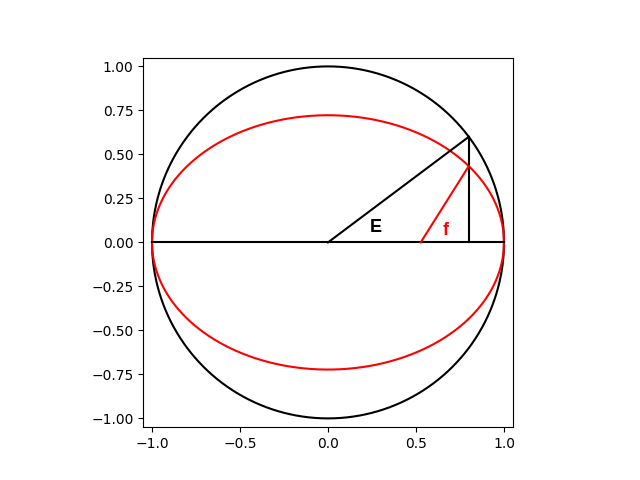

# Two-Body Problem: The Underlying Physics

To understand the way `celmec` calculates the true anomaly, definitions for two additional anomalies are needed. Firstly, mean anomaly \\( M \\) would be the angle from the perihelion if a planet were orbiting the sun on a circular orbit with constant speed. Secondly, eccentric anomaly \\( E \\) is defined as the image below:

  
  <figcaption>Geometric definition of eccentric anomaly</figcaption>

It can be shown, that these two anomalies are related by the Kepler equation:

\\[ M = E - e \sin(E) \\]

where:

\\[ M = \textrm{ mean anomaly } \\]
\\[ E = \textrm{ eccentric anomaly } \\]
\\[ e = \textrm{ eccentricity } \\]

The eccentric anomaly is then related to true anomaly by:

\\[ f = \arccos( \frac{\cos(E) - e}{1 - e \cos(E)} ) \\]

`celmec` solves the Kepler equation for \\( E \\) using the [Newton-Raphson method](https://en.wikipedia.org/wiki/Newton%27s_method) for:

\\[ 0 = E - e \sin(E) - M \\]
